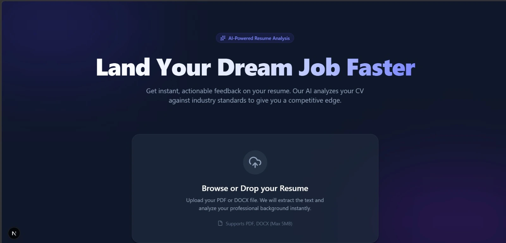

# 🚀 AI-Powered Resume Reviewer

 

Selamat datang di repositori **AI-Powered Resume Reviewer**! Ini adalah aplikasi web modern kelas premium yang mempermudah para *job seekers* untuk mendapatkan umpan balik (feedback) seketika terkait CV/Resume mereka menggunakan ketajaman otak kecerdasan buatan dari **Google Gemini**.

Dibangun dengan **Next.js App Router** untuk kecepatan, dipoles dengan **Tailwind CSS & Framer Motion** untuk antarmuka *glassmorphism* yang cantik, serta dilengkapi pengerjaan parsing PDF dan Word (*client-to-server*), ini merupakan prototipe aplikasi siap-pakai yang luar biasa.

## ✨ Fitur Utama

- **Premium UI/UX:** Antarmuka bergaya elegan dan modern dengan warna indigo yang mewah.
- **Drag & Drop Uploader:** Mendukung *upload file* `.pdf` dan `.docx` dengan animasi interaktif.
- **Pemrosesan CV Aman:** Pemrosesan AI dilakukan sepenuhnya di *Backend/Server API* (Next.js API Routes). Kunci *API key* Anda 100% aman dan tidak terekspos ke *browser* pengguna.
- **Google Gemini 2.5 Flash Integration:** Memanfaatkan model AI keluaran terbaru dengan porsi gratis yang sangat besar untuk *developer*. 
- **Analisis Mendalam:** Memberikan skor rata-rata (0-100), mendeteksi kekuatan, kelemahan, serta saran perbaikan *(actionable recommendations)* berstandar ATS *(Applicant Tracking System)*.

## 🛠️ Tech Stack

- **Framework:** [Next.js (v15 App Router)](https://nextjs.org)
- **Styling:** [Tailwind CSS v4](https://tailwindcss.com) 
- **Animations:** [Framer Motion](https://www.framer.com/motion/)
- **Icons:** [Lucide React](https://lucide.dev/)
- **Document Parsing:** `pdf-parse` (untuk PDF) dan `mammoth` (untuk Word DOCX)
- **AI Engine:** [@google/generative-ai](https://www.npmjs.com/package/@google/generative-ai) (Google Gemini API)

## 🏃 Cara Menjalankan Secara Lokal (Local Development)

Ikuti langkah-langkah di bawah ini untuk mencoba aplikasinya di komputer Anda:

### 1. Instalasi Node.js & Dependencies
Pastikan komputer Anda sudah terinstal *Node.js*. Lalu, buka terminal di *folder* proyek ini dan ketikkan:
```bash
npm install
```

### 2. Dapatkan API Key Google Gemini (Gratis!)
- Masuk ke [Google AI Studio](https://aistudio.google.com/app/apikey).
- Klik tombol **"Create API key"**.
- Salin Kunci (Key) rahasia Anda.

### 3. Konfigurasi File Environment
- Di folder utama proyek ini, buat sebuah file (atau gunakan yang sudah ada) bernama `.env`.
- Masukkan *API key* dari langkah sebelumnya dengan format seperti ini:
```env
GEMINI_API_KEY=KUNCI_RAHASIA_ANDA_DISINI
```

### 4. Nyalakan Development Server
```bash
npm run dev
```
Buka browser dan arahkan ke alamat [http://localhost:3000](http://localhost:3000). Aplikasi siap digunakan!

---

💡 *Proyek ini dibuat sebagai inisiatif asisten web development kelas dunia (Antigravity).*
